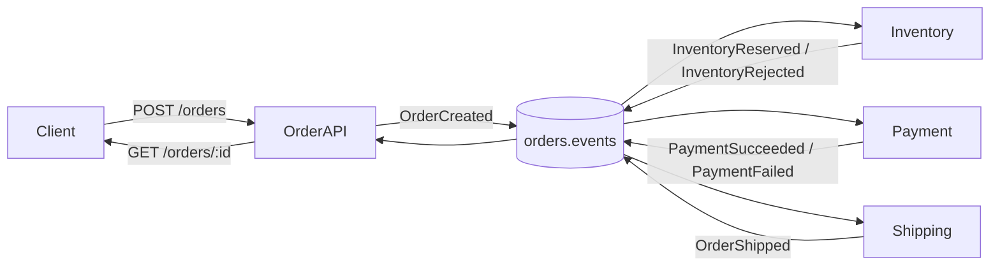

# Order Kafka POC

A Python monorepo demonstrating **event-driven order processing** with Kafka (Redpanda), FastAPI, and SQLite. An order flows through independent microservices that communicate asynchronously via a shared event topic.

## What this demonstrates

- **Choreography-based saga** — no central orchestrator; each service reacts to events and publishes the next step
- **Event sourcing lite** — the order API maintains a full event history per order
- **Idempotent consumers** — each service tracks processed `event_id`s to handle redelivery safely
- **Failure handling** — inventory rejection and payment failure both terminate the flow with `CANCELLED` status

## Architecture



All services publish to and consume from a single topic (`orders.events`). Each service filters for the event types it cares about and ignores the rest.

### Happy-path flow

```
CREATED → RESERVED → PAID → SHIPPED
```

1. **order-api** — accepts the order, persists it, publishes `OrderCreated`
2. **inventory-service** — reserves stock, publishes `InventoryReserved`
3. **payment-service** — processes payment, publishes `PaymentSucceeded`
4. **shipping-service** — ships the order, publishes `OrderShipped`
5. **order-api** (consumer) — listens to all events and updates order status + event log

## Services

| Service | Port | Kafka group | Listens for | Publishes |
|---------|------|-------------|-------------|-----------|
| order-api | 8000 | `order-api` | all events | `OrderCreated` |
| inventory-service | 8001 | `inventory-service` | `OrderCreated` | `InventoryReserved`, `InventoryRejected` |
| payment-service | 8002 | `payment-service` | `InventoryReserved` | `PaymentSucceeded`, `PaymentFailed` |
| shipping-service | 8003 | `shipping-service` | `PaymentSucceeded` | `OrderShipped` |

Each service owns its own SQLite database under `data/`. Services do not call each other over HTTP — all coordination happens through Kafka.

## Event types

| Event | Producer | Payload highlights |
|-------|----------|--------------------|
| `OrderCreated` | order-api | `customer_id`, `items`, `total_amount` |
| `InventoryReserved` | inventory-service | `customer_id`, `items`, `total_amount` |
| `InventoryRejected` | inventory-service | `reason`, `customer_id`, `items`, `total_amount` |
| `PaymentSucceeded` | payment-service | `payment_id`, `amount`, `customer_id` |
| `PaymentFailed` | payment-service | `payment_id`, `amount`, `customer_id`, `reason` |
| `OrderShipped` | shipping-service | `tracking_number` |

Events are JSON documents keyed by `order_id`. Schema is defined in `shared/src/shared/events.py`.

## Project structure

```
order-kafka-poc/
├── shared/                  # Shared library (events, Kafka helpers, DB utils)
├── order-api/               # HTTP API + order status consumer
├── inventory-service/       # Stock reservation
├── payment-service/         # Payment processing
├── shipping-service/        # Shipment creation
├── docker-compose.yml       # Redpanda + Console
└── pyproject.toml           # uv workspace root
```

Managed as a [uv workspace](https://docs.astral.sh/uv/concepts/workspaces/) — run any service with `uv run --package <name>`.

## API

### `POST /orders`

```json
{
  "customer_id": "cust-1",
  "items": [{"sku": "WIDGET-1", "qty": 2}]
}
```

Returns the created order with status `CREATED`.

### `GET /orders/{order_id}`

Returns the order with current status, items, and full event history.

### `GET /health`

Available on all services.

### SKU catalog

| SKU | Price | Initial stock |
|-----|-------|---------------|
| `WIDGET-1` | $50 | 100 |
| `WIDGET-2` | $25 | 0 (always out of stock) |

## Prerequisites

- Python 3.12+
- [uv](https://docs.astral.sh/uv/)
- Docker

## Bootstrap

```bash
uv sync --all-packages
docker compose up -d
```

## Kafka topic

Create the `orders.events` topic before starting the services.

**Redpanda Console:** http://localhost:8080 → Topics → Create topic → name: `orders.events`

**Or via CLI:**

```bash
docker exec redpanda rpk topic create orders.events
```

## Environment

All services read:

```
KAFKA_BOOTSTRAP_SERVERS=localhost:9092
KAFKA_TOPIC=orders.events
```

Optional per-service database paths:

```
ORDER_DB_PATH=data/orders.db
INVENTORY_DB_PATH=data/inventory.db
PAYMENT_DB_PATH=data/payment.db
SHIPPING_DB_PATH=data/shipping.db
```

## Run services

Start each service in a separate terminal:

```bash
uv run --package order-api uvicorn order_api.main:app --reload --port 8000
uv run --package inventory-service uvicorn inventory_service.main:app --reload --port 8001
uv run --package payment-service uvicorn payment_service.main:app --reload --port 8002
uv run --package shipping-service uvicorn shipping_service.main:app --reload --port 8003
```

## Try it

### Happy path

```bash
# Create order
curl -X POST http://localhost:8000/orders \
  -H "Content-Type: application/json" \
  -d '{"customer_id": "cust-1", "items": [{"sku": "WIDGET-1", "qty": 2}]}'

# Poll status (after a few seconds)
curl http://localhost:8000/orders/<order_id>
# Expect: CREATED → RESERVED → PAID → SHIPPED
```

### Failure paths

**Out of stock** — order `WIDGET-2` (zero stock):

```bash
curl -X POST http://localhost:8000/orders \
  -H "Content-Type: application/json" \
  -d '{"customer_id": "cust-1", "items": [{"sku": "WIDGET-2", "qty": 1}]}'
# Expect: CANCELLED (InventoryRejected)
```

**Payment failure** — `customer_id` ending in `fail`:

```bash
curl -X POST http://localhost:8000/orders \
  -H "Content-Type: application/json" \
  -d '{"customer_id": "cust-fail", "items": [{"sku": "WIDGET-1", "qty": 1}]}'
# Expect: CANCELLED (PaymentFailed)
```

**Amount limit** — `total_amount > 1000` (e.g. 21 × WIDGET-1):

```bash
curl -X POST http://localhost:8000/orders \
  -H "Content-Type: application/json" \
  -d '{"customer_id": "cust-1", "items": [{"sku": "WIDGET-1", "qty": 21}]}'
# Expect: CANCELLED (PaymentFailed)
```

## Observability

- **Redpanda Console** — http://localhost:8080 (browse topics, messages, consumer groups)
- **Service logs** — each uvicorn terminal shows consumer activity and event processing
- **Order event history** — `GET /orders/{order_id}` returns the full event trail

## Tests

```bash
uv run pytest shared/tests
```
